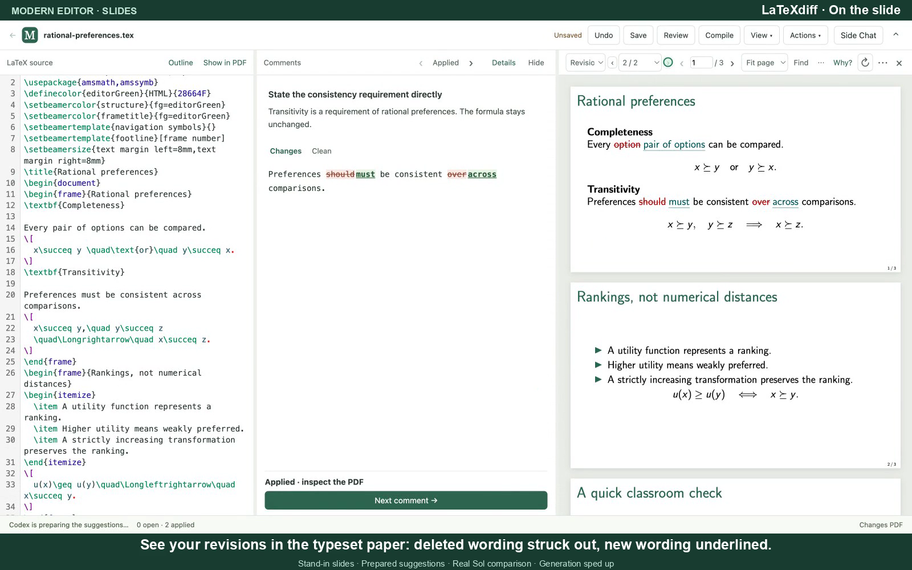
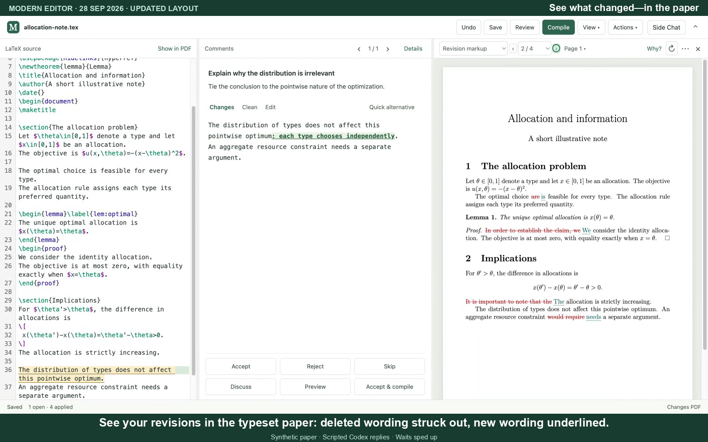

# Modern Editor demonstrations

## Beamer slides and LaTeXdiff · 45 seconds

The 7 October recording shows the current slide-review workflow: preview and accept two wording edits, inspect inline strikeouts and underlining, open **Why?**, read **Clean paper**, and save. Source, Comments and PDF keep the same three-column layout throughout.

[Watch · 3.9 MB](2026-10-07/modern-editor-beamer-45s.mp4) · [Smaller · 1.9 MB](2026-10-07/modern-editor-beamer-45s-small.mp4) · [Transcript](2026-10-07/modern-editor-beamer-45s-transcript.md) · [SRT](2026-10-07/modern-editor-beamer-45s.srt) · [VTT](2026-10-07/modern-editor-beamer-45s.vtt)

The rational-preferences slides and suggestions are synthetic and prepared. Editing, saving, compilation, Sol arrangement and its requested image check are real; generation waits are shortened, as noted on screen. The clip includes narration and captions, without background music. Both downloads use H.264 video and AAC audio. See [slide support and limits](../docs/USER_GUIDE.md#beamer-slides).

## Writing and review demonstrations · 28 September

These three narrated demonstrations show the updated 28 September writing and review layout. Each has a smaller download, English captions, a transcript and background music. The recordings are unchanged historical demonstrations. Later additions—including two-PDF review, comparison exports, JSON import, settings resets, floating Side Chat with separate model controls and multiple suggestions, and two-way PDF/source navigation—are described in the [current guide](../docs/USER_GUIDE.md).

| Video | Length | Large · 1600×1000 | Small · 1280×800 |
| --- | --- | --- | --- |
| Quick overview | 0:55 | [6.4 MB](2026-09-28/modern-editor-overview-55s.mp4) | [2.8 MB](2026-09-28/modern-editor-overview-55s-small.mp4) |
| Full walkthrough | 3:00 | [17.5 MB](2026-09-28/modern-editor-walkthrough-3min.mp4) | [7.9 MB](2026-09-28/modern-editor-walkthrough-3min-small.mp4) |
| Changes PDF / LaTeXdiff | 0:50 | [5.3 MB](2026-09-28/modern-editor-latexdiff-50s.mp4) | [2.5 MB](2026-09-28/modern-editor-latexdiff-50s-small.mp4) |

The overview introduces reviewing and choosing wording. The walkthrough also covers Classic view, Side Chat and saving. The focused Changes PDF clip shows struck deletions, underlined additions, explanations, Clean paper and exact Text diff.

| Captions and text | Transcript | SRT | VTT |
| --- | --- | --- | --- |
| Overview | [Read](2026-09-28/modern-editor-overview-55s-transcript.md) | [Download](2026-09-28/modern-editor-overview-55s.srt) | [Download](2026-09-28/modern-editor-overview-55s.vtt) |
| Walkthrough | [Read](2026-09-28/modern-editor-walkthrough-3min-transcript.md) | [Download](2026-09-28/modern-editor-walkthrough-3min.srt) | [Download](2026-09-28/modern-editor-walkthrough-3min.vtt) |
| Changes PDF | [Read](2026-09-28/modern-editor-latexdiff-50s-transcript.md) | [Download](2026-09-28/modern-editor-latexdiff-50s.srt) | [Download](2026-09-28/modern-editor-latexdiff-50s.vtt) |

Recorded on 28 September 2026 with the local layout update using a synthetic paper and scripted Codex responses. Editing, saving, compilation and comparison PDFs are real. Waiting time is sped up or omitted, as noted on screen; these clips do not demonstrate live model latency or answer quality. All six downloads use H.264 video and AAC audio. Download and play locally if browser playback is unavailable.

The Changes PDF sequence keeps Source, Comments and PDF in the same three columns. It switches only the right-hand viewer; no pane enlargement or cropped close-up is used.

## Previous layout recordings

The 27 September versions remain available: [quick tour](2026-09-27/modern-editor-overview-55s.mp4), [full walkthrough](2026-09-27/modern-editor-walkthrough-3min.mp4) and [LaTeXdiff](2026-09-27/modern-editor-latexdiff-50s.mp4).

## Earlier Changes PDF demonstration

The [26 September version](modern-editor-latexdiff-50s.mp4) and [smaller copy](modern-editor-latexdiff-50s-small.mp4) remain available. [Transcript](latexdiff-transcript.md) · [SRT captions](latexdiff-captions.srt) · [VTT captions](latexdiff-captions.vtt).

## Earlier Side Chat walkthrough

The Modern Editor 0.3.2 walkthrough shows opening a paper, requesting a language review, cycling through corrections with Shift+A, compiling, asking Codex Side Chat about the paper and the editor, turning an answer into a suggestion, saving, comparing versions and closing the project.

| Video | Length | Size |
| --- | --- | --- |
| [Full demonstration](modern-editor-side-chat-demo.mp4) | 2:02 | 6.66 MB |
| [Smaller full demonstration](modern-editor-twitter-full-small.mp4) | 2:02 | 4.47 MB |
| [One-minute highlight](modern-editor-twitter-short.mp4) | 0:59 | 2.65 MB |

The recordings use a synthetic paper and scripted Codex responses; waiting time is edited. Editing, compilation, saving, comparison and closing are real application actions. Shift+A accepts without compiling; Compile updates the PDF, and Accept & compile checks a suggestion before applying it.

All three videos have English captions, H.264 video and stereo AAC audio. If browser playback is unavailable, download the MP4 and open it locally.

Demo narration generated with ElevenLabs. Background music created for this demonstration. See the [third-party notices](../THIRD_PARTY_NOTICES.md#external-tools-and-demonstration).

The [earlier demonstration](modern-editor-demo.mp4) remains available; some controls and labels have since changed. That older file uses HEVC.
