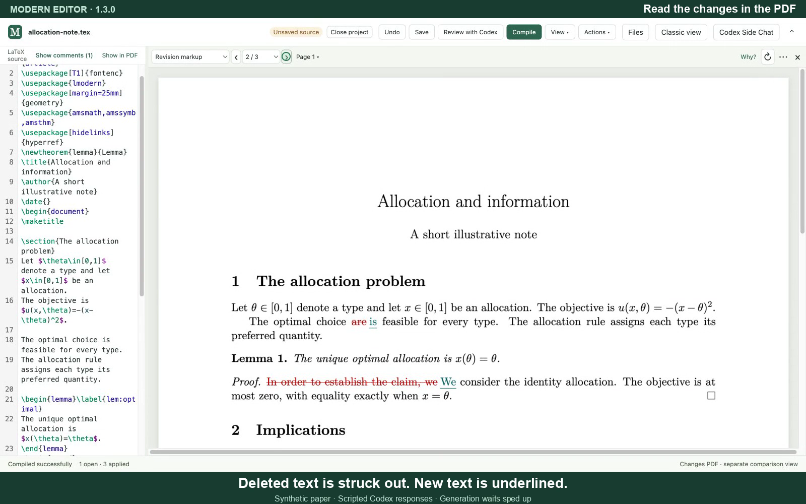

# Modern Editor demonstrations

The **1.3.0 LaTeXdiff demonstration** shows quick acceptance, compilation, Revision markup, Why, Clean paper, exact Text diff, Save and Close project. It has spoken ElevenLabs narration, background music and English captions.

| Latest video | Length | Size |
| --- | --- | --- |
| [LaTeXdiff — large, 1600×1000](modern-editor-latexdiff-50s.mp4) | 0:50 | 6.26 MB |
| [LaTeXdiff — small, 1280×800](modern-editor-latexdiff-50s-small.mp4) | 0:50 | 2.57 MB |

[Transcript](latexdiff-transcript.md) · [SRT captions](latexdiff-captions.srt) · [VTT captions](latexdiff-captions.vtt)

The latest clip uses a synthetic paper and scripted Codex responses. Generation waits are sped up, as noted on screen. The editor operations and generated comparison PDF are real.

## Earlier Side Chat walkthrough

The Modern Editor 0.3.2 walkthrough shows opening a paper, requesting a language review, cycling through corrections with Shift+A, compiling, asking Codex Side Chat about the paper and the editor, turning an answer into a suggestion, saving, comparing versions and closing the project.

| Video | Length | Size |
| --- | --- | --- |
| [Full demonstration](modern-editor-side-chat-demo.mp4) | 2:02 | 6.66 MB |
| [Smaller full demonstration](modern-editor-twitter-full-small.mp4) | 2:02 | 4.47 MB |
| [One-minute highlight](modern-editor-twitter-short.mp4) | 0:59 | 2.65 MB |

The recordings use a synthetic paper and scripted Codex responses; waiting time is edited. Editing, compilation, saving, comparison and closing are real application actions. Shift+A accepts without compiling; Compile updates the PDF, and Accept & compile checks a suggestion before applying it.

All three videos have English captions, H.264 video and stereo AAC audio. If browser playback is unavailable, download the MP4 and open it locally.

Demo narration generated with ElevenLabs. Background music created for this demonstration. See the [third-party notices](../THIRD_PARTY_NOTICES.md#external-tools-and-demonstration).

The [earlier demonstration](modern-editor-demo.mp4) remains available; some controls and labels have since changed. That older file uses HEVC.
